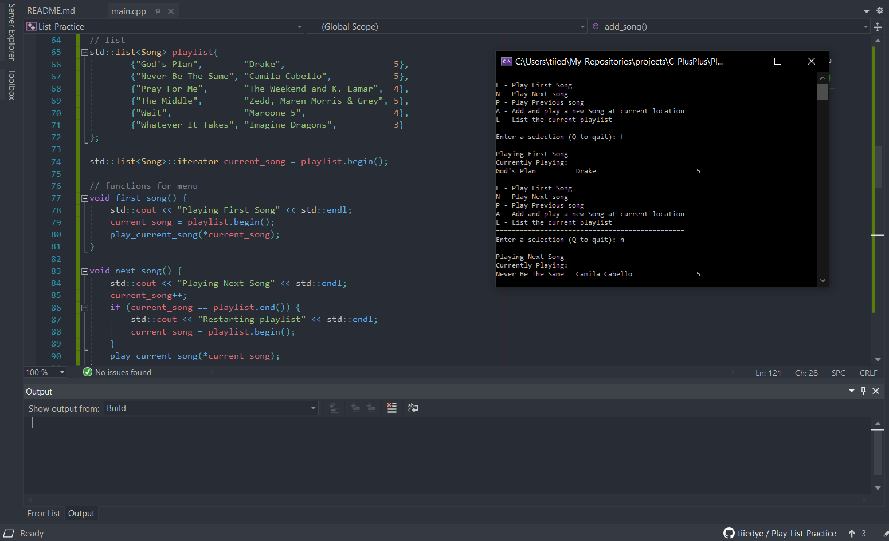

  

# playLIST Practice
A simple program that navigates through a list of songs (playlist) and prints them out on the console. Simulates a music player.

### Instructions
In this challenge you will create a menu driven application that
will simulate a user playing songs from a playlist of songs.

We will use a list to simulate the user selecting the the first song in the playlist and
then selecting next and previous to play forward of backwards through the 
playlist.

Please refer to the video demo run.

We will also allow users to add new song to the playlist and they
will be added prior to the currently playing song.
The menu looks as follows:

F - Play First Song
N - Play Next song
P - Play Previous song
A - Add and play a new Song at current location
L - List the current playlist

========================
Enter a selection (Q to quit):

And the available playlist is modeled as a std::list<Song>
I will provide the Song class. Following are the songs in the playlist.
I grabbed these from the pop charts, you can use them or change 
them to any songs you wish.

God's Plan                  Drake
Never Be The Same   Camila Cabello
Pray For Me               The Weekend and K. Lamar
The Middle                Zedd, Maren Morris & Grey
Wait                           Maroone 5
Whatever It Takes      Imagine Dragons

I have provided the starting project.
Have fun!

Note:
If you have trouble reading input, you can clear std::cin and 
ignore everything in the buffer with:

std::cin.clear();
std::cin.ignore(std::numeric_limits<std::streamsize>::max(),'\n');

Make sure you #include <limits> to use it.
